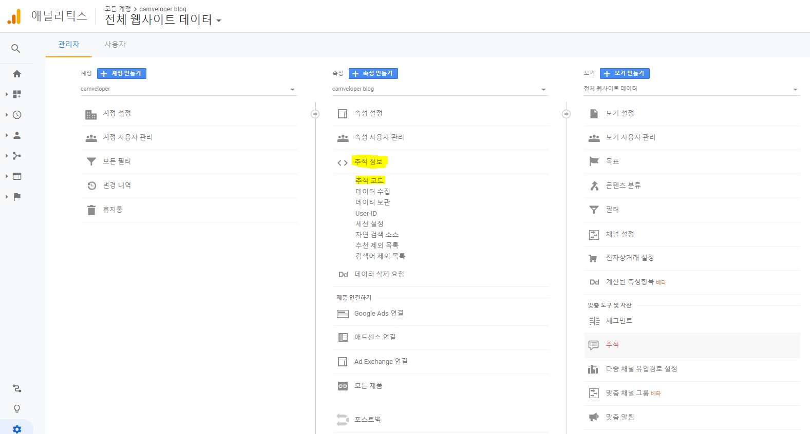

## 1. Analytics 가입 및 추적 코드 생성

[analytics.google.com](https://analytics.google.com/) 에 접속 한다.
계정을 생성 하고, 속성을 생성 한다.
이후 아래와 같이 추적 코드 메뉴를 선택 한다.

선택을 하게 되면, 자신의 추적 코드를 알수 있는데 코드 형식은 다음과 같다.
```
UA-XXXXXXXXX-X
```
그럼 위와 같이 생긴 코드를 잘 기억 한다.

## 2. 플러그인을 하나 설치 한다.
```shell script
npm install --save gatsby-plugin-google-analytics
```

이후, `gatsby-config.js` 파일에 다음 내용을 추가 한다.
```javascript
module.exports = {
  plugins: [
    {
      resolve: `gatsby-plugin-google-analytics`,
      options: {
        // replace "UA-XXXXXXXXX-X" with your own Tracking ID
        trackingId: "UA-XXXXXXXXX-X",
      },
    },
  ],
}
```

이제 모든 화면에 추적코드가 붙게 되고, [analytics.google.com](https://analytics.google.com/) 에서 통계를 확인 할수 있다.