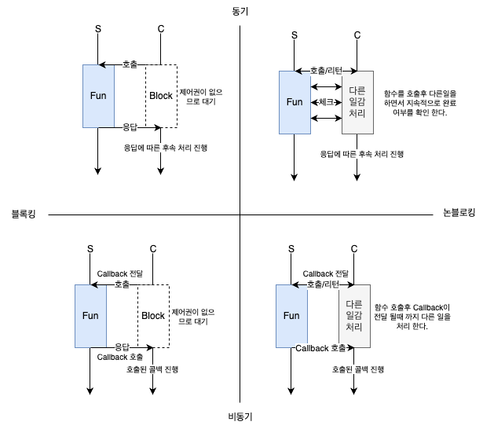

# 들어가기 전에
 요즘 WebFlux를 사용 하다보니 비동기 논블로킹에 대해서 설명 해야 되는일이 간혹 생긴다. 
 그래서 그림으로 간단하게 그려서 설명을 해볼려고 한다.

# 동기와 비동기, 블로킹과 논 블로킹

- 블로킹과 논블로킹은 다른 작업을 호출 후에도 제어권 유무를 의미 한다. 다른 작업을 호출 하였음에도 제어권이 있다는 것은 다른 작업을 진행 할수 있음을 의미 한다.
- 동기와 비동기는 내가 호출한 작업에 대해서 나의 요청의 응답으로 알게 된다면 동기 방식이고, 어떠한 이벤트나 트리거에 의해서 알게 된다면 비동기 방식이다.
