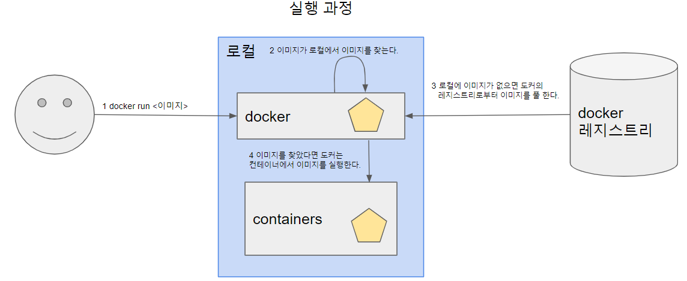
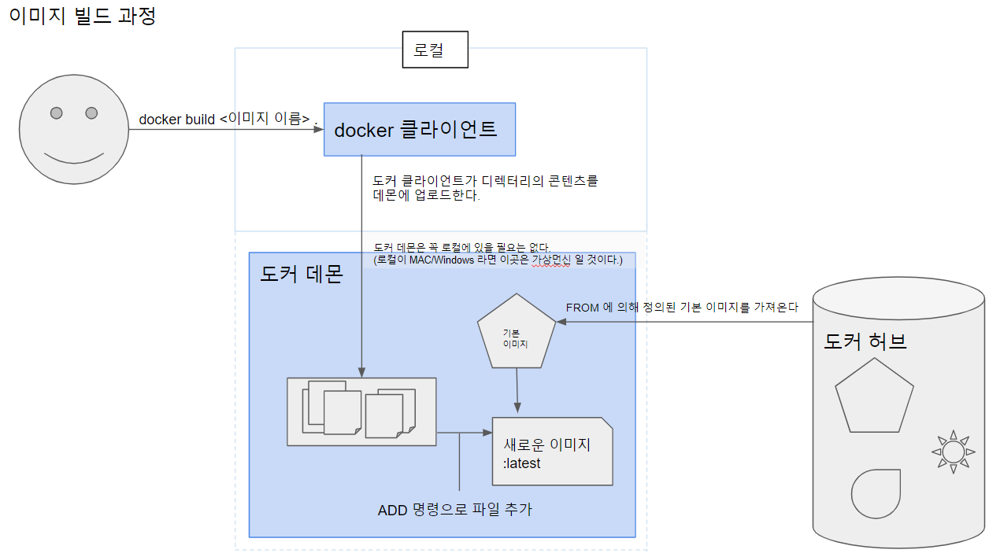

## docker run

docker는 로컬에서 요청한 이미지가 있는지 확인한다. 이미지가 없다면 docker는 레지스트리로부터 최신의(latest) 이미지를 가져온다. 만약 최신의 이미지가 아니라면 <image>:<tag>로 별도의 버전을 명시적으로 지정 해주어야 한다. 이미지를 가져온 docker는 해당 이미지를 격리된 환경인 컨테이너에서 실행하게 된다.

## Dockerfile을 이용한 이미지 생성
그럼 이미지는 어떠게 만들면 될까?
이미지는 수동으로 만드는 방법과 Dockerfile을 이용하는 방법이 있다.
수동으로 이미지를 만드는 것은 기존 이미지에서 컨테이너를 실행하고, 컨테이너 내부에서 명령어를 수행한 후 빠져나와 최종상태를 새로운 이미지로 커밋(commit)하는 방법으로 이미지를 수동으로 생성 할수 있다.

### 1 준비
예제를 위해 간단한 어플리케이션을 생성한다. 
app.js 파일을 생성한다.
```javascript
const http = require('http');
const os = require('os');


console.log("Kubia server starting...");


var handler = function(request, response){
    console.log("Received request from" + request.connection.remoteAddress);


    response.writeHead(200);
    response.end("You've hit " + os.hostname() + "\n");
};


var www = http.createServer(handler);
www.listen(8080);
```
`8080` 포트를 사용하는 간단한 웹서버이다.

이제 Dockerfile 을 생성한다.
```dockerfile
FROM node:7 <1>
ADD app.js /app.js <2>
ENTRYPOINT ["node", "app.js"] <3>
```
* <1> : node 컨테이너 이미지의 태그 7을 기본으로 하는 이미지는 만든다.
* <2> : 명령을 실행한 로컬에 존재하는 app.js 파일을 이미지의 /(루트)에 app.js라는 이름으로 추가한다.
* <3> : 이미지를 실행 했을때 `node app.js` 명령을 실행한다.

### 2 빌드
```shell script
docker build -t <이미지 이름> .
```
문장 끝에 `.` 에 있는 내용대로 이미지를 빌드 하라는 명령이 실행 되었다. 도커는 디렉터리 내 Dockerfile을 살펴보고 파일에 명시된 지시 사항에 근거해 이미지를 빌드한다.

1. 명령어가 입력 되면 도커 클라이언트는 지정된 컨텐츠를 도커 데몬에 업로드 한다.
2. 도커 데몬은 리눅스 OS가 아닌경우 가상머신 내부에서 실행된 데몬이다.
3. FROM 절에 의해 필요한 기본 이미지를 pull 한다. 
4. 새로운 이미지를 만들어 낸다.

```shell script
> docker build -t kubia .
Sending build context to Docker daemon  3.072kB
Step 1/3 : FROM node:7
7: Pulling from library/node
ad74af05f5a2: Pull complete
2b032b8bbe8b: Pull complete
a9a5b35f6ead: Pull complete
3245b5a1c52c: Pull complete
afa075743392: Pull complete
9fb9f21641cd: Pull complete
3f40ad2666bc: Pull complete
49c0ed396b49: Pull complete
Digest: sha256:af5c2c6ac8bc3fa372ac031ef60c45a285eeba7bce9ee9ed66dad3a01e29ab8d
Status: Downloaded newer image for node:7
---> d9aed20b68a4
Step 2/3 : ADD app.js /app.js
---> fd85960a0ec7
Step 3/3 : ENTRYPOINT ["node", "app.js"]
---> Running in 073b6aeff527
Removing intermediate container 073b6aeff527
---> 44ac3ce30230
Successfully built 44ac3ce30230
Successfully tagged kubia:latest
SECURITY WARNING: You are building a Docker image from Windows against a non-Windows Docker host. All files and directories added to build context will have '-rwxr-xr-x' permissions. It is recommended to double check and reset permissions for sensitive files and directories.
```
위에서 확인 할수 있듯이 node 이미지를 pull 할때 여러개의 레이어로 pull이 되는것을 확인 할수 있다.
하나의 이미지는 여러개의 레이어로 구성 되어 있으며, 우리는 이런 이미지를 pull받아 그위에 다른 레이어 (ADD, ENTRYPOINT...등)를 추가하여 새로운 이미지를 생성 하는 것이다.

### 3 이미지 확인
아래와 같이 생성된 이미지를 확인 할수 있다.
```shell script
> docker images
REPOSITORY    TAG                  IMAGE ID            CREATED             SIZE  
kubia         latest               44ac3ce30230        53 minutes ago      660MB
busybox       latest               edabd795951a        3 days ago          1.22MB
```

### 4 컨테이너 이미지 실행 
```shell script
docker run <옵션> <이미지 이름,ID> <명령> <매개변수>
> docker run --name kubia-container -p 8081:8080 -d kubia
```
* kubia 이미지에서 kubia-container라는 이름의 새로운 컨테이너를 실행 하도록 한다.
* `-p 8081:8080` 는 로컬 머신의 8081포트가 컨테이너 내부의 8080포트와 매핑된다.
* `-d`은 datached 모드이며, 데몬 모드라고도 하는데 컨테이너가 백그라운드로 실행 된다.

#### 컨테이너가 정상적으로 실행 되지 않는다면?
실행한 컨테이너를 조회 해본다.
```shell script
> docker ps
```
근데 위와 같이 입력하면, 실행중인 컨테이너는 노출 되지만 실행을 멈춘 컨테이너는 노출 되지 않는다.
```shell script
> docker ps -a
CONTAINER ID   IMAGE   COMMAND               CREATED         STATUS                    PORTS  NAMES
b0681e7e4be6   kubia   "node app.js"         30 minutes ago  Exited (1) 54 seconds ago        kubia-container    
8c172595487f   busybox "echo 'Hello world'"  2 hours ago     Exited (0) 2 hours               gifted_hermann 
```
위와 같이 입력 하면 멈춘 컨테이너가 노출 된다. 그리고 오래전에 실행 했던 컨테이너도 남아 있음을 확인 할수 있다.
컨테이너를 확인을 했다면 다음 명령으로 [ 시작 | 재시작 | 중지 | 접속 | 삭제 | 상세 정보 조회 ]가 가능하다.
```shell script
docker [start | restart | stop | attach | rm | inspect ] <컨테이너 이름 혹은 아이디>
```

### 5 컨테이너 내부에서 shell 실행하기
아래 명령을 이용하여  bash shell을 실행한다.  (어떤 명령어들은 TERM 변수가 선언되지 않아 에러가 난다)
```shell script
docker exec -it kubia-container bash
```
옵션 설명
	* -i : 표준 입력(STDIN)을 오픈 상태로 유지한다. shell에 명령어를 입력하기 위해 필요하다.
	* -t : 의사(pseudo) 터미널(tty)를 할당한다. 입력하지 않으면 프로픔트가 화면에 표시 되지 않는다.

## 참고 
* 쿠버네티스 인 액션 