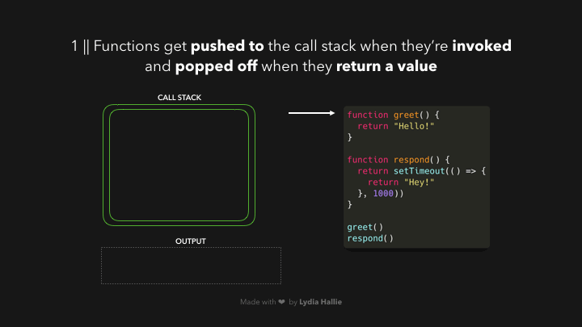

 오래전에 회사 동료가 Front-end에 대한 면접에서 질문으로 setTimeout과 함께 출력 코드가 있을때 결과에 대한 질문을 많이 했다. 
 이것은 javascript의 event loop에 대해서 이해를 해야지 답할수 있는 문제인데, 최근에 다시 한번 이 부분에 대해서 정리를 해둬야 겠다는 생각이 들었다. 
 이미 잘 정리된 영문 내용이 있어서 해당글을 번역과 정리를 해본다.


# JavaScript Visualized: Event Loop

**JavaScript Visualized: Event Loop**를 번역하여 이해 한대로 정리한 글이다.

# 이벤트 루프

이벤트 루프는 태스크 큐와 콜 스택을 연결 해주는 반복 문이다. 콜 스택이 비어 있고, 태스크 큐에 콜백 함수가 있다면, 이벤트 루프틑 태스크 큐에서 첫번째 함수를 인출하여 콜 스택으로 이동 시킨다.

```jsx
while(queue.waitForMessage()){
  queue.processNextMessage();
}
```

## 이벤트 루프 동작 예시

**JavaScript는 단일 스레드이다**. 한번에 하나의 작업만 실행 할 수 있다. 일반적으로 별거 아니지만, 30초가 걸리는 작업이 있다고 생각을 해보자, 브라우저가 “응답없음” 상태에서 멈춰 있고, 매우 느린 웹서핑이 될 것이다.

다행스럽게도 **브라우저**는 JavaScript 엔진 자체가 제공하지 않는 몇 가지 기능인 **Web API를 제공** 한다. 여기에는 **DOM API, `setTimeout` , HTTP 요청** 등이 포함 된다. 이를 통해 비동기 비차단 동작을 생성할 수 있다.

함수를 호출하면 호출 스택이라는 항목에 추가 된다. 호출 스택은 JS 엔진의 일부이며 브라우저에 따라 다르다. 다만 동작 방식은 스택이므로 LIFO 동작을 하게 된다. 함수가 값을 반환 하면 스택에서 제거 된다.



위에서 `respond` 함수는 `setTimeout` 함수를 반환한다. `setTimeout`은 Web API에 의해 제공되며, 메인 스레드를 차단하지 않고 작업을 지연시킬 수 있다.

`setTimeout` 함수에 인자로 전달한 콜백 함수인 화살표 함수 `() => { return 'Hey!' }`는 Web API에 추가된다. 두 번째 인자로 전달한 값에 따라, 해당 콜백 함수는 일정 시간 그 작업이 지연된 후 실행된다. setTimeout 함수와 respond 함수는 스택에서 제거 되며, 각각의 값을 반환하게 된다.


Web API에서는 두번째 인수로 전달 받은 시간 만큼 타이머를 실행 하고, 전달 받은 콜백 함수를 스택에 추가하지 않고 `Task Queue` 라는 곳에 전달 한다.


**콜백 함수는 다른 함수와 다르게 태스크 큐에 저장** 되며, 큐는 말그대로 FIFO 순으로 콜백 함수를 반환하게 된다.

이벤트 루프는 태스크 큐와 호출 스택을 연결한다. 만약, 호출 스택이 비어 있다면, 이벤트 루프는 **태스크 큐에서 콜백 함수를 인출 하여 콜 스택에 추가** 하게 된다. 이 경우에는 **다른 함수는 호출 되지 않으며**, 이는 콜 백 함수가 이벤트 루프에 의해 큐의 첫 번째 항목으로 추가 되기 전까지 호출 스택이 비어 있음을 의미한다.


콜백 함수가 호출 스택에 추가되면, 함수가 호출 되고 그 결과 값을 반환한 뒤 스택에서 제거 된다.


# 예제

다음을 실행하면 콘솔에 실행 결과를 알아 본다

```jsx
const foo = () => console.log("First");
const bar = () => setTimeout(() => console.log("Second"), 500);
const baz = () => console.log("Third");

bar();
foo();
baz();
```


1. bar 함수를 호출 되어 콜 스택에 적재 된다.
 1. bar 함수가 콜 스택에서 제거 되면서 setTimeout 함수가 반환된다.
2. setTimeout은 WEB API(혹은 백그라운드)에 추가되고 타이머가 작동 한다
3. 타이머가 작동하는 동안, foo이 호출 스택에 추가 되고, 실행 되면서 First가 출력 되며, 호출 스택에서 제거 된다.
4. baz가 호출 스택에 추가 되고, 실행 되면서 Third가 출력되고 호출 스택에서 제거 되며 그와 동시에 타이머가 종료된 setTimeout의 콜백 함수가 큐에 등록 된다.
5. Event loop가 Call stack에 아무런 명령이 없는 것을 확인하고, 큐에서 콜백 함수를 호출하여 스택에 등록 후 스택에 콜백 함수를 호출하고, Second를 출력 한다.

## 출력 결과

```
First
Third
Second
```

# 참고

- [MDN :  이벤트 루프](https://developer.mozilla.org/ko/docs/Web/JavaScript/Event_loop)